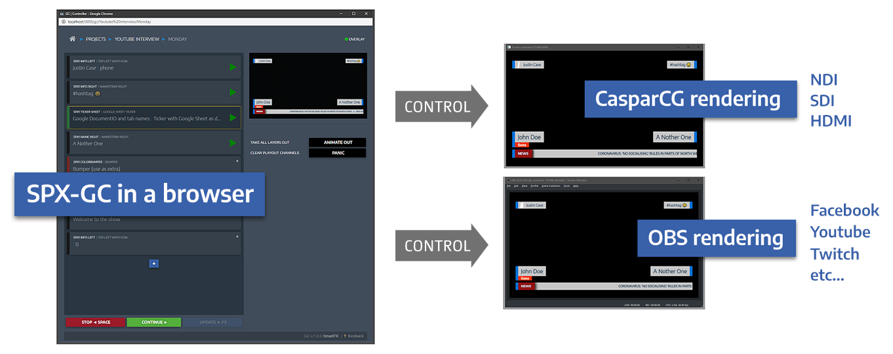
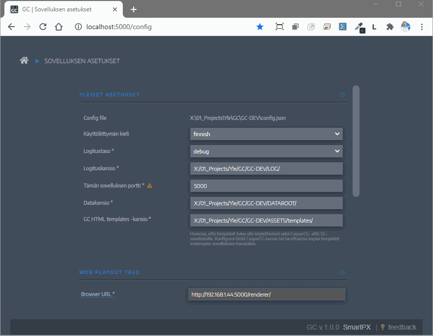
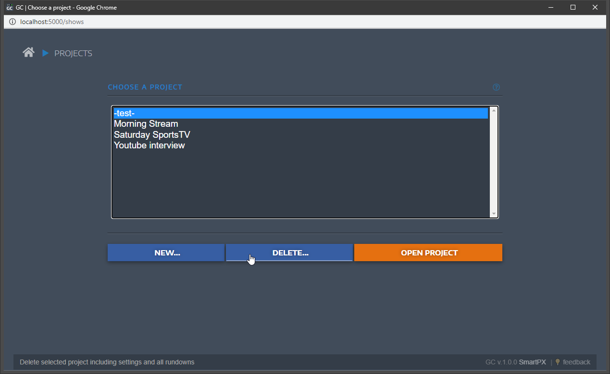
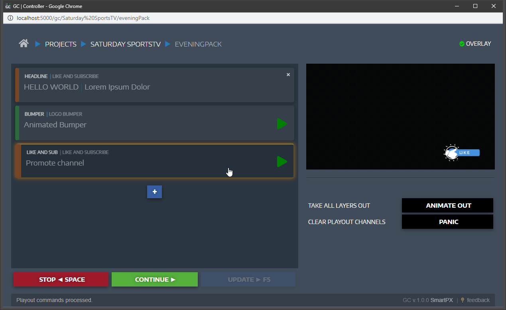
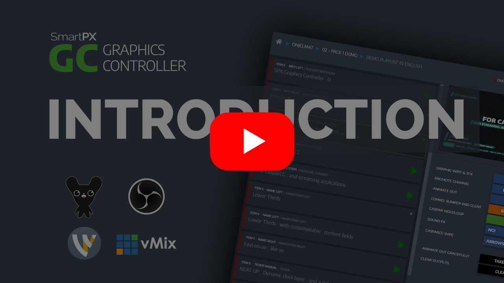
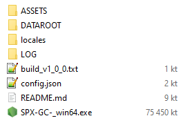
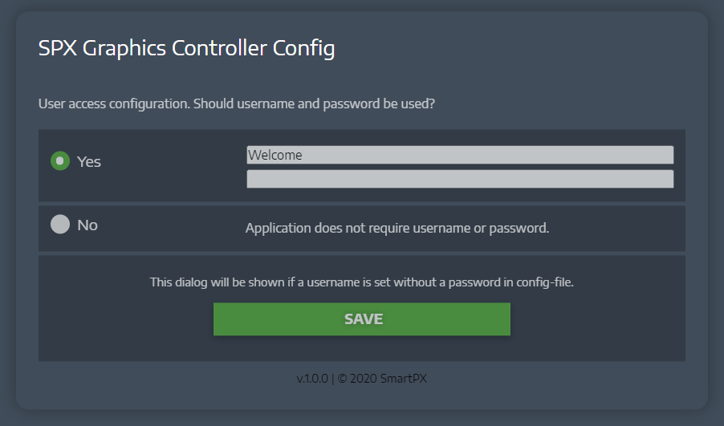
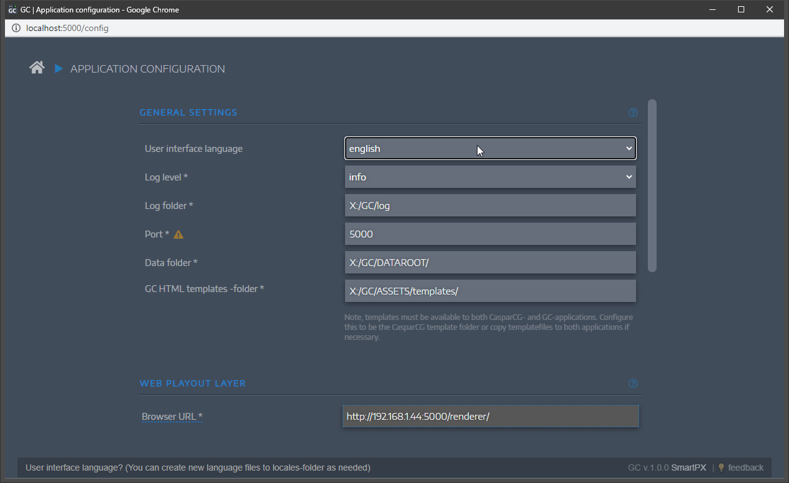

# SPX-GC | SmartPX Graphics Controller

## Manage and control graphics for CasparCG and streaming applications.

> Readme updated Sept 02 2020

>**v.1.0.0** released in Sept 2020


**SPX-GC** is professional graphics controller for live television productions and web streaming. Browser based GUI can control HTML graphics templates on  [CasparCG](https://github.com/CasparCG/) server(s) and live stream applications such as [OBS](https://obsproject.com/), [vMix](https://www.vmix.com/) or [Wirecast](https://www.telestream.net/wirecast/).

_SPX-GC is pronounced __G.C.__ [dʒiː.siː] or just "geesee"_ 😉



**SPX-GC** can be used to playout lower thirds, bumpers, logos and other on-screen graphics in live web streams or live TV broadcasts. Content for the graphic templates are entered into _elements_ which are stored on _rundowns_ within _projects_.

Software is based on a NodeJS server and can be run on Windows, Mac or Linux computers, on-premise or using cloud instances for remote work scenarios.

Graphic templates are typical HTML templates used with CasparCG and other HTML compatible renderers. Integrating existing templates with SPX-GC is done by adding _a template definition_ (javascript-snippet) to them.

Originally SPX-GC was developed by [SmartPX](https://smartpx.fi) for [YLE](https://www.yle.fi), a public broadcaster in Finland. Thanks **Markus Nygård** for the challenge! 🤘

> For extra functionality, integrations and advanced custom templates, do not hesitate to contact tuomo@smartpx.fi.

---

### Table of Contents
- [Screenshots](#screenshots)
- Install [pre-built packages](#install) for Windows, Mac or Linux.  Or build from [source code](#npminstall).
- [Configuration](#config)
- [Projects and rundowns](#dataroot)
- [HTML templates](#templates)
- [Custom controls](#projectextras)
- [Product roadmap](#roadmap)
- [Feedback](#feedback)
- [MIT License](#license)


| Screenshots<a id="screenshots"></a> |   |
| ------ | ------ |
|  | SPX-GC UI is browser based and can be operated with a mouse or keyboard. Additonal _extra controls_ can be added as _plugins_ to execute specific tasks or to trigger events in external devices. |
|  | Content is managed in _projects_. Each project can have unlimited amount of _rundowns_ and _graphics templates_. Projects and their rundowns and settings are stored in _dataroot -folder_. |
|  | Main Controller: rundown with few items and a local preview. Items can be edited and controlled also with keyboard shortcuts. Fullscreen viewing mode recommended. Buttons below preview are customizeable. | 
| [](https://www.youtube.com/watch?v=mnqU3bTeXk8) | An introduction video on Youtube. There are more images in the screenshots -folder.  | 

----
# Installation <a id="install"></a>

SPX-GC can be installed using a **ready-to-go binary package** which includes all required software components. Developers can alternatively get the full source code and run SPX-GC with `npm scripts`, see section [install source code](#npminstall).

### **Available pre-built packages:** <a id="builds"></a>

| Operating system | Zip file| Build date | Notes |
| ------ | ------ | ----- | ----- |
| Windows  | [SPX-GC_1_0_0_win64.zip](   https://storage.googleapis.com/spx-gc-bucket-fi/installers/1.0/SPX-GC_1_0_0_win64.zip   ) | Sept 02 2020 | Most tested version.
| MacOS    | [SPX-GC_1_0_0_macos64.zip]( https://storage.googleapis.com/spx-gc-bucket-fi/installers/1.0/SPX-GC_1_0_0_macos64.zip ) | Sept 02 2020 | Dataroot and config.json may be generated to user's home directory at first launch and app will not run properly. Exit, move config.json and DATAROOT folder to correct folder and edited config.json manually to reflect these path changes.
| Linux   | [SPX-GC_1_0_0_linux64.zip]( https://storage.googleapis.com/spx-gc-bucket-fi/installers/1.0/SPX-GC_1_0_0_linux64.zip ) | Sept 02 2020 | Tested with some flavours of Debian and Ubuntu but user's input is appreciated here, see [feedback](#feedback). |

## Option 1: **Install a pre-built package**
* Download a zip-file for  your system using one of the links above.
* Create a new folder for the app (for example on Windows `C:/Program Files/SPXGC/`, or on Linux `/SPXGC` ).
* Extract the zip-file to that folder.
* Locate the executable (for example `SPX-GC_win64.exe` on Windows) and double click it to start the SPX-GC server. A console window should open (and remain open) and show some startup information. When running application the first time it will create a file structure shown in the below screenshot. Note: unzipping and running SPX-GC does _not_ usually require admin priviledges.
* On Linux add execute permission to the file (`chmod a+x SPX-GC_linux64`) and launch it in a console (`./SPX-GC_linux64`).
* See next steps in section [first launch](#firstlaunch).




## Option 2: **Install from source code** <a id="npminstall"></a>

Developers can get the source code from the repository with [git](https://git-scm.com/) and run the application using [NodeJS](https://nodejs.org/) and [npm](https://www.npmjs.com/).
* Create an empty folder on your system and fetch the source code using a `git clone` command:
```sh
git clone https://github.com/TuomoKu/SPX-GC.git
```
* After downloading the source, install required additional dependencies (node_modules) with

```sh
npm install
```
* See `package.json` for available scripts, but in **development** the typical start script would be `npm run dev` which will use _nodemon_ to restart the server when changes are made to source files.
```sh
npm run dev
```
#### pm2 process manager<a id="pm2"></a>
* Installation of `pm2` process manager ([https://pm2.keymetrics.io/](https://pm2.keymetrics.io/)) can help in advanced production installations.
* To run the server in **production mode** use `npm start` which will run the server in the background with `pm2` process manager which will automatically restart the server if a crash occurs. Deeper usage and configuration options of _pm2_ is outside the scope of this readme-file. 

```sh
npm start
```
* To run several instances of SPX-GC (on different ports) with `pm2` prepare a `ecosystem.config.js` -file with details of each instance, such as:
```javascript
// Example "ecosystem.config.js" file for pm2 to run multiple instances of SPX-GC.

module.exports = {
  apps : [
    {
    'name': 'GC1',
    'script': 'server.js',
    'args': 'config.json'
    },
    {
      'name': 'GC2',
      'script': 'server.js',
      'args': 'config5001.json'
      }
  ]
};

```
Then launch multiple instances with pm2:
```sh
pm2 start ecosystem.config.js
```


---
# First launch <a id="firstlaunch"></a>
* Open web browser (such as Chrome) and load SPX-GC gui from url shown in the console at the start-up:
```
--------------------------------
  SPX-GC url:
  http://192.148.1.22:5000
--------------------------------
```
>Port 5000 is the default value in config. In some virtual machines the IP address shown may show the _internal IP_ but the _external IP_ must be used instead.

If installation and server start-up worked, you should see a Config screen in your browser asking a preference regarding user access.

There are two alternatives:
  * **`YES`**: Username and password are reguired to access the application.
  * **`NO`**: Application will not require a login.
  * This config screen is shown
    * at first startup, or
    * when `config.json` is missing, or
    * when `config.json` **has** username but password is left **empty**

Depending on the selection made, you will either be asked to login or you land to the Welcome page and you are free to explore the application. If password is given it will be stored in the config-file in unreadable, encrypted format.

> By default the dataroot is **empty** and has no projects.

Start making [configuration changes](#config) or creating [projects](#dataroot) and adding [templates](#templates) and adding those to [rundowns](#rundown) for playout.
You can also follow these steps to get yourself familiarized with the application:

1. Open SPX-GC in browser, typically at http://localhost:5000
2. Choose 'no login' policy by selecting **No** option and click **Save**
3. Go to **Projects**
4. Add a new project, for instance `My First Project`. (Project's settings opens.)
5. Click **[ + ]** button to add the first template to the project
6. Browse to `smartpx > Template_Pack_1` -folder and choose `SPX1_INFO_LEFT.html` -template
7. Go back to **Projects**
8. Double click `My First Project` to open it
9. Add a new rundown to this project, for instance `My First Rundown`. (The new empty rundown opens.)
10. Click **[ + ]** button to add an item to the rundown
11. Pick **SPX1_INFO_LEFT** -template
12. Double click rundown item to edit it, enter "Hello world!" and click **Save** to close the editor
13. Play the item with **SPACEBAR** or by clicking on **PLAY** button at the bottom of rundown list.


Congratulations! Now go back to your project's settings and add more templates to it...

> When a new version becomes available it will be shown on the Welcome page of the application.


# App configuration options <a id="config"></a>
> Application **DOES NOT** come with `config.json` and it will be generated at server start up.

SPX-GC uses a `JSON file` to store configuration settings, such as folder paths, playout server settings or user interface language options. Most of the settings can be changed from the configuration page.



Some rarely used settings are left out from configuration page and can be changed by manually modifying the _config file_ in a text editor.


The default configuration file name is `config.json` but it is possible to run the server with a specific configuration file. For instance you might have two instances running on the same system, using shared project files and templates but on different server ports and using different renderers. (See also [pm2 process manager](#pm2))

To run the server with another config, provide the config file as the first command line argument, for example:
```sh
SPX-GC_win64.exe myOtherConfig.json
```


An example `config.json` of the SPX-GC server
```json
{
  "general": {
    "username": "welcome",
    "password": "",
    "langfile": "english.json",
    "loglevel": "info",
    "logfolder": "X:/GC-DEV/LOG/",
    "port": "5000",
    "dataroot": "X:/DATAROOT/",
    "templatefolder": "X:/GC-DEV/ASSETS/templates/"
  },
  "casparcg": {
    "servers": [
      {
        "name": "OVERLAY",
        "host": "localhost",
        "port": "5250"
      },
      {
        "name": "VIDEOWALL",
        "host": "128.120.110.1",
        "port": "5250"
      }
    ]
  },
  "globalExtras": {
    "customscript": "/ExtraFunctions/demoFunctions.js",
    "CustomControls": [
      {
        "ftype": "button",
        "bgclass": "bg_black",
        "text": "ANIMATE OUT",
        "fcall": "stopAll()",
        "description": "Take all layers out"
      },
      {
        "ftype": "button",
        "bgclass": "bg_red",
        "text": "PANIC",
        "fcall": "clearAllChannels()",
        "description": "Clear playout channels"
      }
    ]
  }
}
```
>**Please note**: the server will fail to start if config is not valid JSON. You can use [JSONLint](https://jsonlint.com/) to validate JSON data.

**langfile** is a filereference in locales-folder for a JSON file containing UI strings in that language. You can copy an existing file to another name and modify it's contents. Folder is scanned at server start and files are shown in the configuration as language options.

**loglevel** default value is `info`. Other possible values are `error` (least), `warn`, `verbose` and `debug` (most log data). All log messages are stored into log files in logfolder. The active file is named `access.log`. Log files can be useful in troubleshooting.

<a id="globalextras"></a> **globalExtras** are additional user interface controls, or _plugins_, shown below preview window in all project as opposed to [projectExtras](#projectextras) which are project specific. Each item has an UI component (a button) and associated function call available in the specified `javascript file`. When a new `config.json` is created it has some demo extra controls to introduce related consepts and possibilities.

----

# Projects and rundowns <a id="dataroot"></a>
All content in SPX-GC is stored as files in `dataroot` folder which is specified in the configuration.

* **Projects** are _subfolders_ in the dataroot-folder
* **Rundowns** are _files_ in project subfolders.

Projects can be added and removed on the _Projects_ page and rundowns can be added and removed inside project on the _Rundows_ page. Most changes are saved automatically. If the UI becomes unresponsive it is usually fixed by refreshing the current page (Ctrl+R).

```
File structure of dataroot:

⏵ LOG
⏵ ASSETS
⏷ DATAROOT
   ┝━⏵ Project A
   ┝━⏵ Project B
   ┕━⏷ Project C
        ┝━━  profile.json
        ┕━⏷ data
             ┝━ Rundown 1.json
             ┕━ Rundown 2.json
```
>Typically users don't need to do any manual file management using computer's filesystem.

<a id="profile"></a>**Project specific settings**, such as assigned templates and project extras are stored into `profile.json` within each project folder.

**Templates** can be added to a project on the project settings page. When a template (a .html file) is browsed and selected, the system will scan the file and search for a [template definition](#definition) which will tell SPX-GC what kind of input fields should be generated for that template and how the template is planned to be played out. Template defaults are stored to project's `profile.json` (as "copy") and if HTML template's definition related details are changed afterwards the template must be imported to the project again. The system does not re-scan added templates.

> If selected template does NOT have template definition it will cause an `error:templateDefinitionMissing` -message. See section [html templates](#templates).


<a id="projectextras"></a> **showExtras** are additional user interface controls, or _plugins_, shown below preview window in current project as opposed to [globalExtras](#globalextras) which are shown in every project. Each item has an UI component (a button) and associated function call available in the specified `javascript file`.

```json
{
  "templates": [
    {
      "description": "Hashtag one-liner",
      "playserver": "OVERLAY",
      "playchannel": "1",
      "playlayer": "7",
      "webplayout": "7",
      "out": "4000",
      "uicolor": "7",
      "onair": "false",
      "dataformat": "xml",
      "relpath": "myTemplates/ProjectA/hashtag.html",
      "DataFields": [
        {
          "field": "f0",
          "ftype": "textfield",
          "title": "Social media hashtag",
          "value": "#welldone"
        }
      ],
    }
  ],
  "showExtras": {
	"customscript": "/ExtraFunctions/demoFunctions.js",
	"CustomControls": [
        {
          "description": "Play simple bumper",
          "ftype": "button",
          "bgclass": "bg_orange",
          "text": "Bumper FX",
          "fcall": "PlayBumper",
        },
        {
          "description": "Corner logo on/off",
          "ftype": "togglebutton",
          "bgclass": "bg_green",
          "text0": "Logo ON",
          "text1": "Logo OFF",
          "fcall": "logoToggle(this)"
        },
        {
          "description": "Sound FX",
          "ftype": "selectbutton",
          "bgclass": "bg_blue",
          "text": "Play",
          "fcall": "playSelectedAudio",
          "value": "yes.wav",
          "items": [
              {
                  "text": "No!",
                  "value": "no.wav"
              },
              {
                  "text": "Yesss!",
                  "value": "yes.wav"
              }
          ]
        },
	  ]
	}
}
```
> The above project has just one template (`hashtag.html`) assigned with three extra controls of different types. 

Custom control's ftype can be 
* **button**: a simple push button (with `text` as caption)
* **togglebutton**: button with separate on / off states
* **selectbutton**: a select list with an execute selection button
* **ftypes**
    - `hidden` value is used, title shown
    - `textfield` a typical input field
    - `dropdown` options provided as an array
        - `"items":[ {"text": "Hundred", "value": 100}, {"text": "Dozen", "value": 12} ]`
        - `value` is one of the item array values
    - `caption` text of "value" is shown in UI. Useful with static graphics.


----

# Templates
SPX-GC uses HTML templates for visuals.

They can have any features supported by the renderers, such as Canvas objects, WebGL animations, CSS transforms and animations, animation libraries, such as GSAP, ThreeJS, Anime, Lottie/Bodymovin and templates can utilize ajax calls for data visualizations and other advanced uses.

```
Recommended folder structure for templates

⏵ LOG
⏵ DATAROOT
⏷ ASSETS
   ┝━⏵ video
   ┝━⏵ media
   ┕━⏷ templates
        ┝━⏵ smartpx
        ┝━⏵ yle
        ┕━⏷ myCompany
             ┝━⏵ ProjectA
             ┕━⏷ ProjectB
                  ┝━⏵ css
                  ┝━⏵ js
                  ┝━ Template1.html
                  ┕━ Template2.html

```
> The templates must be within `ASSETS/templates` folder structure. It is preferred to have a single subfolder for all _your_ templates (myCompany in the example above) and futher subfolders for different _template packs_ or _visual styles_ within it (ProjectA, ProjectB in the example).

>**CasparCG** does not support absolute file paths with HTML-templates. SPX-GC loads templates from ASSETS/templates -folder which acts as a http server. **The simplest** way to configure CasparCG and SPX-GC together is to make ASSETS/templates folder the templates folder of CasparCG. To make this change, move your existing HTML-templates to ASSETS/templates and re-configure `caspar.config` to use that as `templates-folder`. Another approach is to copy the templates to **both locations** but this can become cumbersome if changes are made to templates: the changes will need to be done to two places or those folders will need to be mirrorred somehow. See this [Wikipedia article](https://en.wikipedia.org/wiki/Comparison_of_file_synchronization_software).

## SPXGCTemplateDefinition -object in templates

TemplateDefinition configures how a template is supposed to work by within SPX-GC, what kinds of controls are shown to the operator and how the graphic should playout. These values are `defaults` and can be changed in the Project Settings view.

Each HTML template must have an `JSON data object` present in the HTML-files source code, within the HEAD section. 


> See details about supported values below the snippet.

```html
<!-- An example template definition object for SPX-GC. -->
<!-- Place it as the last item within the HEAD section -->

<script>
    window.SPXGCTemplateDefinition = {
        "description": "Top left with icon",
        "playserver": "OVERLAY",
        "playchannel": "1",
        "playlayer": "7",
        "webplayout": "7",
        "out": "manual",
        "uicolor": "2",
        "DataFields": [
            {
                "field" : "f0",
                "ftype" : "textfield",
                "title" : "Info text",
                "value" : ""
            },
            {
                "field": "f1",
                "ftype": "dropdown",
                "title": "Select icon",
                "value": "live.png",
                "items": [
                    {
                        "text": "No icon",
                        "value": "empty.gif"
                    },
                    {
                        "text": "Telephone",
                        "value": "phone.png"
                    },
                    {
                        "text": "Live",
                        "value": "live.png"
                    }
                ]
            }
        ]
    };
</script>
```

* **playserver**: one of the available CasparCG server names in config or "-" for none
* **playchannel**: CasparCG playout channel
* **playlayer**: CasparCG playout layer
* **webplayout**: a number between 1..20, or "-" for none
* **out**: how layer should be taken out:
  * `manual` default way: press STOP to animate out
  * `none` play only. Suitable for wipes / bumpers
  * `[numeric]` milliseconds until STOP is executed
* **dataformat**: how template is expecting data
    - `xml` the default
    - `json` used in some special templates
* **ftypes**
  - _ftypes_ (for field types) define template's GUI controls in SPX-GC controller
  - the first two values are used as content preview in the rundown, so the order of fields should be considered for the ease of use
  - `textfield` a typical input field
  - `hidden` value is used, title shown
  - `dropdown` options provided as an array
      - `"items":[ {"text": "Hundred", "value": 100}, {"text": "Dozen", "value": 12} ]`
      - `value` is one of the item array values
  - `caption` text of "value" is shown in UI. Useful with static graphics.
  - **Note** additional user interface controls, such as multiline textarea and a file picker, will be added in future releases.

> The developer of the HTML template can consider how to utilize these values, for instance a `dropdown` control can be used to pick the name of the show host, or it can drive other values via javascript in the templates. See /ASSETS/templates/smartpx -folder for some inspiration.

----

# Feedback <a id="feedback"></a>
Github [issue tracker](https://github.com/TuomoKu/SPX-GC/issues) should be used for bug reports. For other feedback such as feature requests or other comments (for now at least) please use Google Forms feedback form at <A href="https://forms.gle/T26xMFyNZt9E9S6d8">https://forms.gle/T26xMFyNZt9E9S6d8</A> or directly by email to tuomo@smartpx.fi.

>All constructive feedback is highly appreciated!

### _Gotcha's & Known Issues_ (things to be aware of)
- If UI becomes wonky reload the view (F5 / Ctrl+R).
- In some cases after sorting (drag-drop) and/or deleting items from the rundown play/continue/stop commands may effect incorrect items. Workaround: always refresh view (Ctrl+R) after sort/delete operations. This is a known [issue (#1)](#1) and will be fixed in v.1.1.
- Some comments in the source code suggest that importing a "faulty template" can clear or corrupt the entire profile.json -file. (Need to check this).
- Event with "none" out-mode sometimes gets stuck to "onair" mode in the GUI [issue (#2)](#2).
- There is spagetti code whenever worked tired. Try to accept it...
- Undocumented features do exist. (templateEvents, TTS, pm2, cfg:hostname/usercommapass/greeting...)
- This list shouldn't be. At least not here.

----

# Roadmap <a id="roadmap"></a>
New releases will try address found issues and bugs in older versions and they will also introduce new features and functionality. See table for some planned features and use [feedback](#feedback) to submit suggestions.

A marketplace for SPX-GC compatible HTML -templates and plugins will open by the end of 2020. 

> When a new version becomes available it will be promoted on the Welcome page of the application (if access to internet). Several versions can be installed (into different folders) and if there are no backwards compatibility issues between versions they can be configured to use the same dataroot and template -folder. 


| Release | Planned features (subject to change)| Timeframe |
| ------ | ------ | ----- |
| 1.1  | Mac install folder [issue (#3)](#3) fix . Help page update, internal logic change to fix [playlist item issue (#1)](#1), simple rundown view for mobile / tablet browsers, automatically running rundowns, item grouping, textarea control, global extras editor in appconfig, item / file duplication. Project and rundown rename. | Q4/2020 |
| X.X  | Under consideration: mediafile picker, video playback control templates, additional preview modes (while editing, simulation, rtsp stream). HTML template marketplace. Video tutorials. Wiki. Forum. Slack support channel. Free lunches. | TBD |


----

# MIT License <a id="license"></a>
Copyright 2020 Tuomo Kulomaa <tuomo@smartpx.fi>

This project is licensed under the terms of the MIT license.
See [LICENSE.txt](LICENSE.txt)